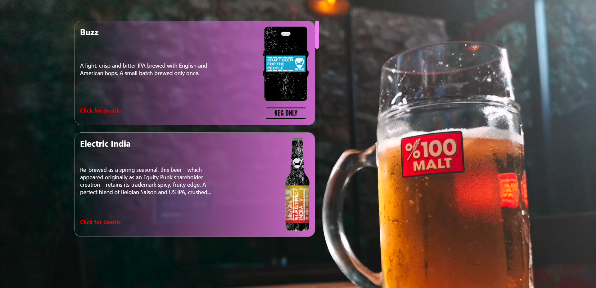
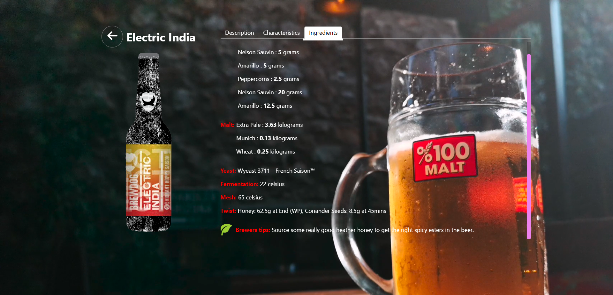

### Use 

To use the application, follow next steps:

1. Clone the repository: `git clone` *https://github.com/sl7one/airo-medical-test*
2. Install dependencies: `npm install`.
3. Start the development server: `npm start`

or follow this link [https://sl7one.github.io/airo-medical-test/](https://sl7one.github.io/airo-medical-test/)

### Technologies

[react, react-router-dom, react-tabs, react-tooltip, zustand, typescript, axios]

### Screens

